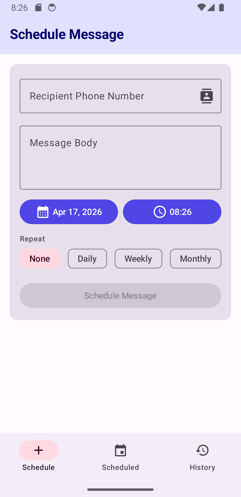
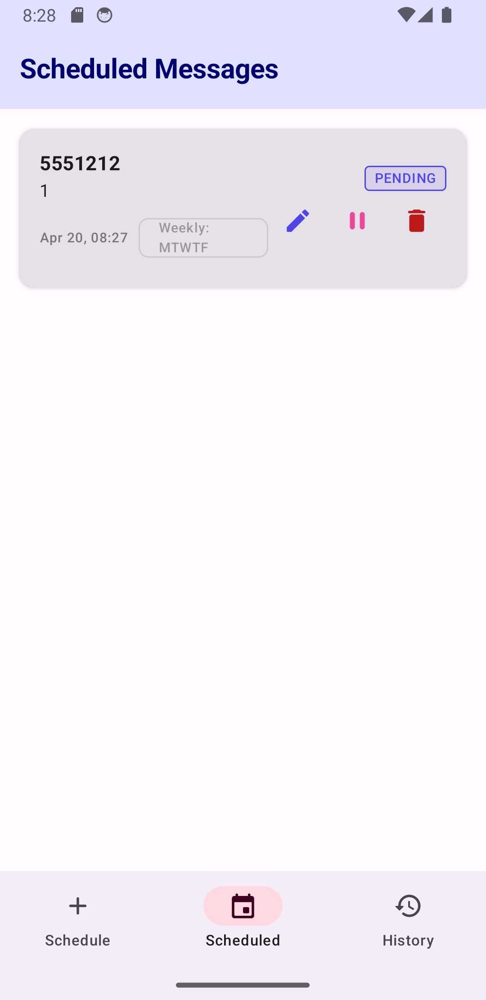
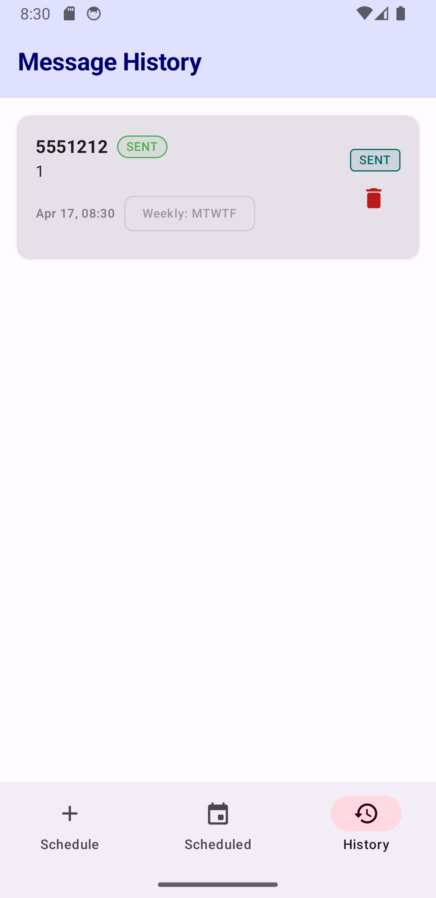

# Message Scheduler

Message Scheduler is a modern Android application built with Jetpack Compose that allows users to schedule SMS messages for later delivery. Whether it's a birthday greeting, a reminder, or a recurring notification, Message Scheduler ensures your messages are sent exactly when they need to be.

## Features

- **Schedule SMS**: Set a specific date and time for your messages.
- **Contact Integration**: Easily pick recipients from your phone's contact list.
- **Recurring Messages**: Schedule messages to repeat Daily, Weekly (on specific days), or Monthly.
- **Manage Scheduled Messages**:
  - **Pause/Resume**: Temporarily stop a scheduled message and resume it later.
  - **Edit**: Modify the recipient, content, or schedule of a pending message.
  - **Delete**: Remove messages you no longer wish to send.
- **Message History**: Keep track of sent and failed messages.
- **Boot Persistence**: Scheduled messages are preserved even after your device restarts.

## Tech Stack

- **UI**: Jetpack Compose with Material 3
- **Database**: Room (for local storage of scheduled messages)
- **Background Tasks**: WorkManager (to handle precise timing and delivery)
- **Permissions**: Accompanist Permissions (to handle SMS and Contact access)
- **Language**: Kotlin

## Installation

For detailed instructions on how to build, install, and configure the necessary permissions (including Restricted Settings on Android 13+), please see the [INSTALL.md](./INSTALL.md) file.

## Screenshots

  
  
  

## License

This project is licensed under the MIT License - see the LICENSE file for details.
